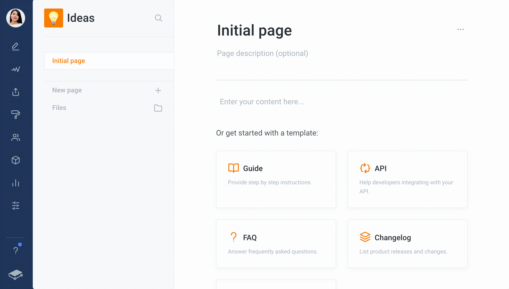
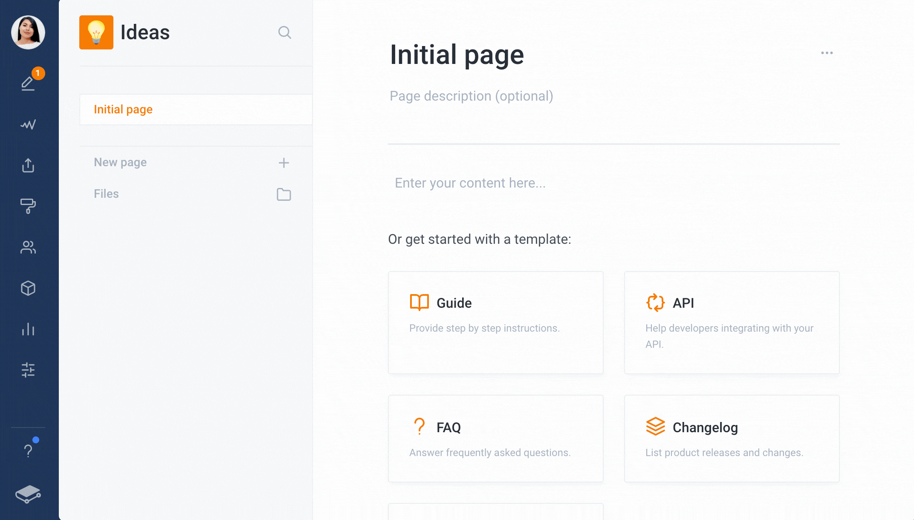
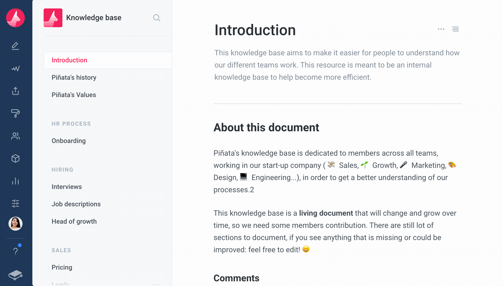
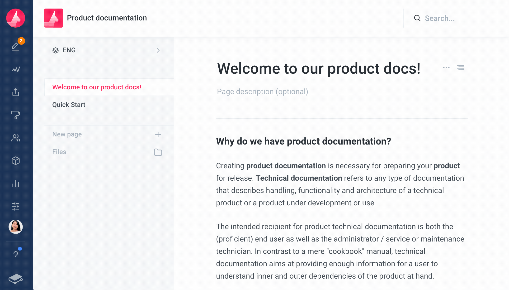

# GitBook 入门指南

GitBook 是一款现代化的文档平台，支持团队协作，可以在上面写产品文档、内部知识分享、接口文档等。GitBook 有网页版和本地版两种，网页版地址如下：[https://www.gitbook.com/](https://www.gitbook.com/)，本地版地址如下：[https://github.com/GitbookIO/gitbook](https://github.com/GitbookIO/gitbook)。

本地版是基于 Node.js 开发的，所以需要本地安装 Node.js 环境，本地版现已停止维护了，而且本地版的大部分功能网页版都支持，所以本教程主要是介绍网页版的使用方式。

GitBook 和 GitHub 是什么关系呢？这是两个相互独立的网站，但是你在 GitBook 上创建的文档可以同步到 GitHub 仓库，每次对文档的修改都会生成一个 commit，GitBook 会自动帮你提交到 GitHub，这样有助于追溯历史版本。而你往 GitHub 提交的内容也会自动同步到 GitBook。（具体怎么在 GitBook 和 GitHub 之间建立关联一会儿会讲到，但是在这之前，我假设你已经会使用 GitHub 了，如果你没有，可以点击下方的链接获取相关教程。）



## 注册 GitBook 账号

打开 GitBook 网址后，点击「Sign Up」按钮注册一个 GitBook 账号，也可以直接用谷歌账号或者 GitHub 账号登录。


登录后的页面应该是类似这样：


## 创建 Space

这里我们遇到了第一个 GitBook 的重要概念——Space，可以理解为空间或者项目。一个 space 里面应该是同一类文档，比如当你要写一本书时，你需要新建一个 space，把所有的章节都放到这个 space 中；再比如开始一个新的项目，也得新建一个 space，把需求文档、技术方案文档、接口文档、测试用例等都放到这个 space 中。

点击右上角的「Create a new space」按钮就可以新建 space，非常简单，只需输入 space 的名字，以及选择主题颜色和可见性就可以。如果是团队内部文档，就选择 Private，这样的话这个 space 只能团队内部成员可见，如果是公开的产品使用说明等，就选择 Public，互联网上的任何一个人都可以看到。然后点击右下角的「Create」按钮创建 space。


比如我给 space 取名叫做「GitBook-Demo」，可见性选择 Public：


点击「Create」后，浏览器跳转到下面这个页面


## Page

这里遇到了第二个 GitBook 的重要概念——Page。顾名思义，一个 page 就是一个页面。page 是 GitBook 组织文档的最小单位。当我们创建一个 space 的时候，GitBook 自动帮我们创建了一个 page，名字叫做 Initial page，就是你现在看到的那个。这个页面可以分为 4 个部分，如下图所示：


编号 1 的区域是文档标题，你可以修改；编号 2 的区域可以手动输入文档内容；编号 3 的区域是 GitBook 提供的一些文档模板，点击之后文档内容就变成了对应的模板内容。编号 4 的区域是 GitBook 提供的文档导入的功能，可以导入外部站点的内容或者外部文件，支持的文件类型有 Markdown 文件（.md 或者 .markdown）、HTML文件（.html）以及 Word 文件（.docx），如果想一次导入多个文件，可以把 Markdown 文件或者 HTML 文件打包成压缩包（.zip 格式的）然后上传。

（我试了一下导入 Markdown 文件，并不是太好用，导入速度很慢，而且很大概率会导入失败，其他文件类型没试，感兴趣的读者可以试一下。那么如果你有已经写好的 Markdown 文件，想导入到 GitBook 怎么办呢？可以用通过 GitHub 同步，同步方式后面会讲到。）

GitBook 提供的「所见即所得」编辑器非常强大，支持富文本和 Markdown 两种输入方式。具体的使用方式可以参考官方文档，这里不再做过多说明。

富文本：

* [https://docs.gitbook.com/editing-content/rich-content](https://docs.gitbook.com/editing-content/rich-content)
* [https://docs.gitbook.com/editing-content/rich-text](https://docs.gitbook.com/editing-content/rich-text)

Markdown：

* [https://docs.gitbook.com/editing-content/markdown](https://docs.gitbook.com/editing-content/markdown)

当你开始编辑文档的时候，GitBook 就自动帮你创建了一个 draft，也就是草稿，编辑完成后，点击「Save」按钮或者按「⌘ + S」（macOS）或者「Ctrl + S」（Windows），就可以保存草稿。保存之后，还需要点击「Merge」按钮，才会生成最终版本的文档。之所以这样设计，是因为 GitBook 是支持团队协作的，一个文档可以同时被多个人编辑，可以这么理解，第一步的「保存」只是将你自己编辑的版本保存了下来，而「合并」则是将所有已保存的文档版本合并，形成最终的文档。





建议给每一个保存的草稿都起个名字，给他们一个主题，说明本次修改的内容，这样可以帮助你在合并之前检查，也可以清楚地看到大家都对文档做了哪些工作。

可以用鼠标把一个 page 拖到另一个 page 下面，前者成为后者的子页面，同时可能会被隐藏，但是也可以点击父 page 右侧的箭头展开。理论上可以无限嵌套页面，但是 GitBook 建议嵌套层级最好不要超过 3 层。



## Group

然后介绍一下第三个 GitBook 的概念——Group。group 是 page 的一种组织形式， 位于 space 里面，可以包含多个 page。group 的创建方式如下：


假如一个 space 是为项目创建的，那么我们应该在这个 space 里面创建多个 group，用以对不同的文档进行分类，需求文档放到一个 group 里，技术方案放到一个 group 里，测试文档放到一个 group 里。效果如下。


## 将 space 同步到 GitHub 仓库

GitBook 的 space 相当于 GitHub 的 repository，即仓库，两者可以互相同步。

### 建立联系

首先，建立两者之间的联系。

你需要先在 GitHub 新建一个空仓库，仓库名不用非得与 space 的名称一致，不过为了方便寻找，还是建议命名保持一致。新建仓库的时候只需输入一个仓库名，其他所有的选项都用默认的即可。


新建之后，GitHub 页面应该是这样的。


然后回到 GitBook，打开一个 space 后，点击左侧的 Integrations，然后点击 GitHub 对应的那个开关按钮


会弹出如下图所示的对话框。点击「List only public repositories」或者「List all repositories」都可以，看你要同步的 GitHub 仓库是公开的还是私有的。


之后会跳转到 GitHub 授权页面，我已经登录 GitHub 了，所以显示内容是这样的，如果你没有登录 GitHub，可能会让你输入账号密码。


授权之后，选择刚才创建的那个 GitHub 仓库，点击「Next」按钮。


然后是选择分支，GitBook 默认是将 space 的内容同步到 master 分支，因为原来 GitHub 的主分支名叫 master，但是现在改名叫 main了，所以如果你用默认的选项，GitBook 会在 GitHub 仓库中自动创建一个 master 分支，这当然没问题。如果你不想创建新的分支，直接同步到 main 分支，那就点击右边的「Select branches to sync」，然后把 master 改成 main 就可以了。


然后点击「Next」，如果出现下面这个界面，就说明连接成功了。GitBook 和 GitHub 之间可以互相同步了。


打开 GitHub 刚才创建的那个仓库，可以看到文件同步过来了。如果没有的话，可能是 GitBook 新建了一个分支，你可以看看有没有其他分支。


我这里就有两个，其中 main 是 GitHub 默认的主分支，master 是 GitBook 创建的分支。


### GitBook 同步到 GitHub

当你在 GitBook 上修改了文档内容，保存并合并之后，文档就会自动同步到 GitHub。


刷新 GitHub，可以看到刚才编辑的内容已经同步过来了。


### GitHub 同步到 GitBook

如果你是修改 page 的内容，那么直接在 GitHub 上修改，或者把仓库中的文件克隆到本地，修改完再上传就可以，提交的 commit 会自动同步到 GitBook。

如果是增加 page，或是调整文档的结构，稍微麻烦点。文档的组织结构是在仓库根目录中一个叫做 SUMMARY.md 的文件中定义的，以 GitBook-Demo 为例，我们看一下 SUMMARY.md 的内容：


红色方框内是 group 名字，绿色方框内是它各个 group 包含的 page，其中方括号内是 page 标题，圆括号内是 page 文件的相对路径。假设我们想在「需求文档」这个 group 下面增加一个标题为「需求文档3」的 page，需要三步操作。

第一步：对 SUMMARY.md 的内容做如下修改：

```text
### 需求文档

* [需求文档1](xu-qiu-wen-dang/xu-qiu-wen-dang-1.md)
* [需求文档2](xu-qiu-wen-dang/xu-qiu-wen-dang-2.md)
* [需求文档3](xu-qiu-wen-dang/xu-qiu-wen-dang-3.md)
```

第二步：在「xu-qiu-wen-dang」目录下增加一个名为「xu-qiu-wen-dang-3.md」的文件


以下是文件内容。


第三步：将修改提交到 GitHub 仓库。我是将 GitHub 仓库克隆到本地然后修改的，所以我需要 push 到远程仓库，你也可以直接在网页上修改。修改的时候要注意分支，如果和 GitBook 建立关联的分支是 master，那你只有在 master 分支上修改才会自动同步到 GitBook，如果是修改的其他分支，需要合并到 master 分支才可以。

然后去 GitBook 查看，可以看到，已经同步过来了。


通过这种方式，就可以把已经存在的文档直接导入到 GitBook。

## Variant

Variant 也是 GitBook 中一个很重要的概念，相当于 GitHub 仓库中的分支，是一个 space 的不同版本。什么情况下需要用到 variant 呢？举个例子，比如你开发了一个中间件，写了这个中间件的文档。随着中间件版本的不断迭代，文档也应该随之更新，但是老版本的文档怎么办呢？肯定不能覆盖，因为可能有人在用你的老版本的中间件，这些人需要看老版本的文档，所以这个时候可以基于老版本文档创建 variant，然后在 variant 上修改文档，老版本的文档保持不变。每发布一个新版本的中间件，就创建一个相应的 variant，这样既不会对老用户产生影响，也可以更新文档。

再比如，如果你的文档有多个语言版本，也可以针对每种语言创建 variant。

下图是创建 variant 的方式。



以上便是 GitBook 的入门教程，掌握了这些，你就可以将 GitBook 用起来了。除了这些，GitBook 还支持对文档添加评论、将文档导出为 PDF 文件、在页面中嵌入视频、外部文章等功能，这些在官方文档中都有介绍，你可以边使用边探索，这也是一种乐趣。

同时，GitBook 还有强大的团队协作功能，但是我现在还没有用过，等我亲身体验过以后，会放到 GitBook 进阶篇里介绍。

## 参考资料

1. [https://docs.gitbook.com/](https://docs.gitbook.com/)

欢迎关注我的微信公众号，扫描下方二维码或微信搜索：王虾片，就可以找到我，我会持续为你分享 IT 技术。


