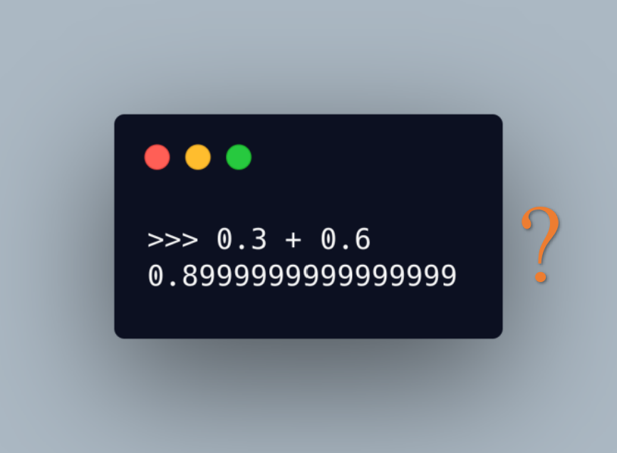

# 一文读懂浮点数

小数在日常生活中经常用到，比如超市中商品的价格、零件的尺寸等等，计算机作为计算的工具，也必然要支持小数。在计算机中，小数的类型有两种，一种是定点数，即小数点后面的位数是固定的，最典型的定点数就是 [BCD 编码](https://zh.wikipedia.org/wiki/%E4%BA%8C%E9%80%B2%E7%A2%BC%E5%8D%81%E9%80%B2%E6%95%B8)；还有一种是浮点数，浮点数的小数点是浮动的，小数点后面的小数位数不固定，这也是本文的主角。

本文将主要讨论以下几个问题：

* 计算机如何存储浮点数（IEEE-754 标准）
* 二进制浮点数与十进制小数之间的相互转化
* 浮点数如何做加法运算
* 为什么浮点数运算会导致精度损失（0.3+0.9=0.8999999）

## 计算机如何存储浮点数

IEEE-754 标准中定义了计算机如何用 32 个比特位存储一个浮点数：从左边起，第 1 位是符号位，用 s 表示，s=0 表示正数，s=1 表示负数；第 2 位到第 9 位是指数位，用 e 表示；第 10 位到第 32 位是有效数位，用 f 表示。知道了s、e、f，根据下面的公式，就可以算出浮点数的值：

$$(−1)^s×1.f×2^{e-127}$$


e 为啥要减 127 呢？因为 e 是 8 位，能表示 0 ~ 255 之间的整数，那么「e - 127」的范围就是 -127 ~ 128，不过由于 e = 0 和 e = 255 时有特殊用途，所以，e - 127 实际的范围是 -126 ~ 127。你可能会问，为什么指数部分不用二进制补码来表示负数，而是用「e 减去 127」这种方式？第一是因为 e = 0 时有特殊用途，没法用于补码；第二是因为采用「减去一个固定值」的方式更容易进行浮点数之间大小的比较。

上面这个公式是没法表示 0 的，所以 IEEE 规定，当 e = 0 且 f = 0 时，就认为这个浮点数是 0。还有其他一些特殊情况，见下表：


看到上面的公式，你可能会感到疑惑，1.f 是二进制数，但是 $$2^e$$ 不是二进制数（二进制数里面只有 0 和 1），那这个公式应该怎么算？其实可以这样，如果你想要二进制数，就根据 e 去移动 1.f 中的小数点，当 e&gt;0 时，小数点向右移动，当 e&lt;0 时，小数点向左移动，e 是几就移动几位，移动完小数点就得到了二进制的浮点数；如果你想要十进制数，就把 1.f 转成十进制，然后按照十进制的规则去计算 $$2^e$$ ，最后把两者相乘，就得到了十进制的浮点数。（无论是二进制还是十进制，都不要忘了前面的符号位）

比如下面这个浮点数


s = 0，e = 126，所以 e - 127 = -1，f = 0，所以它表示的二进制浮点数是： $$(-1)^0\times 1.0 \times 2^{-1}=0.1$$ ，十进制就是 $$(-1)^0\times 1.0 \times \frac{1}{2}=0.5$$ （十进制中 $$2^{-1}=\frac{1}{2}$$ ）

这种用 32 个比特位表示的浮点数我们称之为单精度浮点数，即 float，还有一种用 64 个比特位表示的浮点数，我们称之为双精度浮点数，即 double。double 的指数位长度是 11，有效数位长度是 52，所以 double 能够表示的数的范围更广，精度更高。

下图为 double 的各区域的长度。


由于 double 的指数位长度变成了 11，所以计算 double 浮点数的值的公式应该是$$(−1)^s×1.f×2^{e-1023}$$

## 十进制小数 → 浮点数

十进制小数要想转换成二进制，要把小数部分乘以 2，乘积记做 r，如果 r &gt; 1，则记下 1，令 $$r = (r - 1) \times 2$$ ​，继续循环操作；如果 r &lt; 1，则记下 0，令 ​ $$r=r\times 2$$，继续循环操作；如果 r = 1，则记下 1，计算结束。计算过程的伪代码如下：

```text
 r = n * 2  // n 是十进制的小数
 s = "0."   // s 是最终结果，用字符串表示
 while r != 1:
     if r > 1:
         s += '1'
         r = (r - 1) * 2
     else if r < 1:
         s += '0'
         r *= 2
 s += '1'
```

当我们尝试把十进制的 0.3 转换成二进制时，你会发现，我们得到的是 0.0100110011…，这里的「0011」会无限循环下去，如果用上面这段伪代码去计算 0.3 的二进制，它会陷入死循环，永远无法结束！按照上次讲的 IEEE-754 标准，0.3 应该表示成 ​ $$(-1)^0\times 1.00110011\dots \times 2^{-2}$$ ，如果在计算机中存储为 32 位的浮点数，即 float，就是这样：


虽然小数点部分的「0011」是无限循环的，但是计算机的位数是有限的，以 float 为例，小数点后的有效数位长度只有 23，超过 23 位的部分都被「截」掉了，所以计算机是无法精确表示 0.3 的。虽然 64 位浮点数 double 的有效数位更长，但是对于小数点后无限循环的二进制小数来说，double 同样无法精确表示，顶多就是精度比 float 更高而已。

如果你仔细观察，会发现在上图中的有效数位 f 中，最右边的三位是 010。如果按照 00110011… 这样循环下去，取前 23 位，最后得到的数应该是 00110011001100110011001，那么最右边三位应该是 001 才对啊，怎么是 010 呢？这其实涉及到了浮点数的舍入问题。


上面这张图展示了 0.3 的有效数位，上面那行（即白色背景）数字是实际存储在计算机中的，也就是舍入后的，下面那行（绿色背景 + 橙色背景）是舍入前的，其中橙色背景的是需要舍入的部分。默认的舍入规则是舍入到最接近，一样接近的情况下偶数优先。比如上面那张图中，直接舍掉的话结果是 00110011001100110011001，与直接舍掉相比，舍入前的数字显然更接近 00110011001100110011010（不要忘了我们讨论的只是小数部分，前面还有一个默认的「1.」），所以我们最终得到的有效数位 f 就是 00110011001100110011010。

还有一种情况，就是舍入前的有效位数不是无限循环的，比如这样：


这种情况下，只有最右边的 1 需要舍入，而 0.001100110011001100110011 与 0.00110011001100110011001 和 0.00110011001100110011010 的距离是一样的，都相差 0.000000000000000000000001，这时就按照偶数优先的原则，让 1 进位，得到 0.00110011001100110011010。

IEEE 标准总共列出了 4 种不同的方法：

* **舍入到最接近**：舍入到最接近，在一样接近的情况下偶数优先（Ties To Even，这是默认的舍入方式）：会将结果舍入为最接近且可以表示的值，但是当存在两个数一样接近的时候，则取其中的偶数（在二进制中是以 0 结尾的）。
* **朝 +∞ 方向舍入**：会将结果朝正无限大的方向舍入。
* **朝 -∞ 方向舍入**：会将结果朝负无限大的方向舍入。
* **朝 0 方向舍入**：会将结果朝 0 的方向舍入。

## 浮点数的加法运算及精度损失

浮点数做加法运算遵循一个原则，那就是**先对齐，再计算**。

「对齐」指的是对齐指数位 e。两个浮点数相加时，如果 e 不一样，就要先把 e 对齐再做加法运算。如何对齐呢？对齐的原则就是把 e 都统一成其中较大的一个。

比如 0.5 与 0.125 相加，这两个数表示成浮点数分别是 $$(-1)^0\times 1.0 \times 2^{-1}$$ ​ 和 $$(-1)^0\times 1.0 \times 2^{-3}$$ ​，由于 0.5 的指数大于 0.125 的指数，所以要把 0.125 的指数统一成和 0.5 一样的 -1，指数增大，那么有效数位要右移，因为 f 前面默认有个 1，所以右移之后，0.125 的有效数位 变成了 01，然后将 0.5 的有效数位与 0.125 的有效数位相加，结果还是 01，最终表示成浮点数就是 ​ $$(-1)^0\times 1.01 \times 2^{-1}$$ 。

如果有效数位相加的过程中得到的结果大于 1 了，那么要让有效数位进行右移，同时指数增加相应的值，右移了几位，指数就加几。右移时必然会有丢失的有效数，如果这些有效数都是 0 还好，不会有影响，如果丢失的有效数中包含 1，就要按照前面讲的舍入规则进行舍入，从而造成了精度损失。

如果两个相加的单精度浮点数的指数位相差超过了了 23，也就是差不多 1600 万倍，那么相加的结果就等于较大的那个数。你可以在 Java 中用 float 类型的 2000 万加 1，循环 1000 万次，看看结果是多少。

当你 Python 或 Java 计算 0.3 + 0.6 时，得到结果是 0.8999999999999999，而不是 0.9，这也是精度损失造成的。



现在我们来看一下为什么 0.3 + 0.6 = 0.8999999999999999。

Python 和 Java 默认都是使用 64 位的浮点数，所以 0.3 和 0.6 的浮点数表示形式如下：

0.3 ：


0.6：


注意，这个时候其实计算机中存的已经不是精确的 0.3 和 0.6 了，然后按照我们刚才讲的浮点数加法运算的规则，先对齐，再计算，得到的结果是：


把这个结果换算成十进制，就是 0.8999999999999999。

还记得前面那段十进制小数转二进制的伪代码吗？事实上，如果你用 Java 或是其他的编程语言实现这段伪代码，然后用它去计算 0.3 对应的二进制，你会发现代码并不会陷入死循环，而是会循环 27 次，然后结束执行。这也是因为在循环的过程中有精度损失，然后满足了 r = 1 的条件，就结束循环了。

为了避免浮点数运算带来的精度损失，计算机科学家发明了 [Kahan Summation](https://en.wikipedia.org/wiki/Kahan_summation_algorithm) 算法，该算法对应的 Java 代码如下：

```java
public class KahanSummation {
  public static void main(String[] args) {
    float sum = 0.0f;
    float c = 0.0f;
    for (int i = 0; i < 20000000; i++) {
      float x = 1.0f;
      float y = x - c;
      float t = sum + y;
      c = (t-sum)-y;
      sum = t;      
    }
    System.out.println("sum is " + sum);   
  }  
}
```

这个算法的原理其实并不复杂，就是在每次的计算过程中，都用一次减法，把当前加法计算中损失的精度记录下来，然后在后面的循环中，把这个精度损失放在要加的小数上，再做一次运算。

_**参考资料：**_

1. [**极客时间 -《深入浅出计算机组成原理》第 15 讲、第 16 讲**](https://time.geekbang.org/column/intro/170)
2. [**https://www.h-schmidt.net/FloatConverter/IEEE754.html**](https://www.h-schmidt.net/FloatConverter/IEEE754.html)
3. **《计算机组成与设计：硬件 / 软件接口》3.5.1 节**
4. [**https://zh.wikipedia.org/wiki/IEEE\_754**](https://zh.wikipedia.org/wiki/IEEE_754)
5. [https://en.wikipedia.org/wiki/Kahan\_summation\_algorithm](https://en.wikipedia.org/wiki/Kahan_summation_algorithm)


_发布时间：2021年 2 月 5 日_


