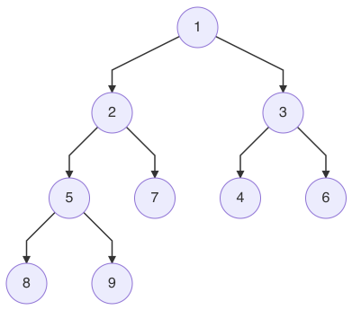
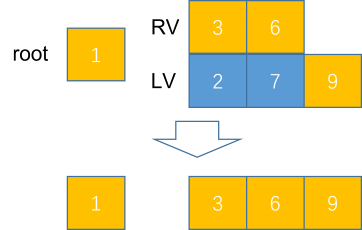
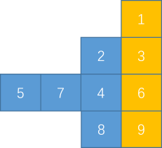

# 199. Binary Tree Right Side View

## 问题链接

* 英文网站：[199. Binary Tree Right Side View](https://leetcode.com/problems/binary-tree-right-side-view/)
* 中文网站：[199. 二叉树的右视图](https://leetcode-cn.com/problems/binary-tree-right-side-view/)

## 问题描述

Given the `root` of a binary tree, imagine yourself standing on the **right side** of it, return _the values of the nodes you can see ordered from top to bottom_.

**Example 1:**


```text
Input: root = [1,2,3,null,5,null,4]
Output: [1,3,4]
```

**Example 2:**

```text
Input: root = [1,null,3]
Output: [1,3]
```

**Example 3:**

```text
Input: root = []
Output: []
```

**Constraints:**

* The number of nodes in the tree is in the range `[0, 100]`.
* `-100 <= Node.val <= 100`

## 解题思路

### 思路一：递归

我们把二叉树的右视图形成的列表记为 V，$$V_1\sim V_h$$ 分别代表右视图从上到下每一个节点的值，h 是二叉树的高度。通过观察其实不难发现，$$V_1$$ 一定等于根节点 root 的值。我们把二叉树的左子树的右视图形成的列表记为 LV、右子树的右视图形成的列表记为 RV，根据 LV 和 RV，可以得到 $$V_2\sim V_h$$ ，具体做法如下：同时遍历 LV 和 RV，如果 $$RV_i$$ 有值，则 $$V_{i+1}=RV_i$$ ，如果 $$RV_i$$ 没有值，则取 $$LV_i$$，直至遍历结束。

比如这样一棵二叉树：



它的根节点是 1，LV 是 `[2, 7, 9]`，RV 是 `[3, 6]`，那么它的右视图 V 就等于 `[1, 3, 6, 9]`



而 LV 可以根据左子树的根节点、左子树的左子树的右视图、左子树的右子树的右视图得到，同理，RV 可以根据右子树的根节点、右子树的左子树的右视图、右子树的右子树的右视图得到。

根据以上思路，我们可以写出如下递归代码：

```java
public List<Integer> rightSideView(TreeNode root) {
    if (Objects.isNull(root)) {
        return new ArrayList<>();
    }
    List<Integer> rightResult = rightSideView(root.right);
    List<Integer> leftResult = rightSideView(root.left);
    ArrayList<Integer> result = new ArrayList<>(Math.max(rightResult.size(), leftResult.size()) + 1);
    result.add(root.val);
    int i = 0;
    for (; i < rightResult.size(); i++) {
        result.add(rightResult.get(i));
    }
    for (; i < leftResult.size(); i++) {
        result.add(leftResult.get(i));
    }
    return result;
}
```

该代码的时间复杂度不大好算，有兴趣的读者可以算一下，空间复杂度是 O\(h-1\)，h 是二叉树的高度。

### 思路二：层次遍历

还是以这个二叉树为例，我们把它每一层的节点都拿出来放到列表里，并进行右对齐。




可以发现，二叉树的右视图其实就是每层最右边的节点组成的列表。所以，我们可以对二叉树进行层次遍历，把每一层的最右边一个节点记录下来，最后就得到了二叉树的右视图。如果对二叉树的遍历不熟悉，可以参考这篇文章：[二叉树的遍历详解](https://blog.csdn.net/young2415/article/details/87467118)

代码如下：

```java
public List<Integer> rightSideView(TreeNode root) {
    LinkedList<Integer> result = new LinkedList<>();
    if (Objects.isNull(root)) {
        return result;
    }
    LinkedList<TreeNode> levelA = new LinkedList<>(), levelB = new LinkedList<>();
    levelA.addFirst(root);
    while (!levelA.isEmpty()) {
        TreeNode treeNode = levelA.removeLast();
        if (Objects.nonNull(treeNode.left)) {
            levelB.addFirst(treeNode.left);
        }
        if (Objects.nonNull(treeNode.right)) {
            levelB.addFirst(treeNode.right);
        }
        if (levelA.isEmpty()) {
            result.add(treeNode.val);
            LinkedList<TreeNode> tempList = levelB;
            levelB = levelA;
            levelA = tempList;
        }
    }
    return result;
}
```

代码时间复杂度为 $$O(h^2-1)$$，因为要遍历二叉树所有的节点，而最坏情况下，二叉树为满二叉树，节点数量为 $$h^2-1$$；空间复杂度是 $$O(2^{h-1})$$，遍历过程中需要存储每一层的节点，满二叉树的最后一层节点数量最多，为 $$2^h-1$$。h 是二叉树的高度。

## 相关题目

[树](https://leetcode.com/tag/tree/)、[深度优先搜索](https://leetcode.com/tag/depth-first-search/)、[广度优先搜索](https://leetcode.com/tag/breadth-first-search/)、[二叉树](https://leetcode.com/tag/binary-tree/)


_发布时间：2021年7月4日_


