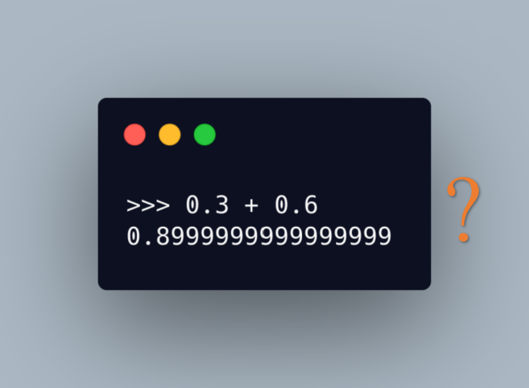

# 92. Reverse Linked List II

## 问题链接

* 英文网站：[92. Reverse Linked List II](https://leetcode.com/problems/reverse-linked-list-ii/)
* 中文网站：[92. 反转链表 II](https://leetcode-cn.com/problems/reverse-linked-list-ii/)

## 问题描述

Given the `head` of a singly linked list and two integers `left` and `right` where `left <= right`, reverse the nodes of the list from position `left` to position `right`, and return *the reversed list*.

**Example 1:**


```
Input: head = [1,2,3,4,5], left = 2, right = 4
Output: [1,4,3,2,5]
```

**Example 2:**

```
Input: head = [5], left = 1, right = 1
Output: [5]
```

 **Constraints:**

- The number of nodes in the list is `n`.
- `1 <= n <= 500`
- `-500 <= Node.val <= 500`
- `1 <= left <= right <= n`

 **Follow up:** Could you do it in one pass?

## 解题思路

对于链表反转相信大家都不陌生，这道题是链表反转的升级版，不是反转整个链表，而是反转指定的两个结点之间的链表（包含指定的这两个结点），不管是反转整个链表还是反转链表的某一部分，都离不开「反转」这个基本操作，我们先来复习一下，链表反转的核心代码如下：

```java
public ListNode reverse(ListNode head) {
    if ( Objects.isNull(head)) {
        return head;
    }
    ListNode p = head, q = head.next, t;
    head.next = null;
    while(q != null){
        t = q.next;
        q.next = p;
        p = q;
        q = t;
    }
    return p;
}
```

对于这道题目而言，由于不是反转整个链表，所以我们要关注三个部分：1. 被反转的链表之前的部分；2. 被反转的链表；3. 被反转的链表之后的部分。我们需要在链表反转后将这三个部分重新连接起来。举个例子，假设有下面这样一个链表，left 为 3，right 为 6。注意：left 和 right 指的是序号，left 为 3 就是指从左往右数第 3 个结点（从 1 开始计数）。



橙色的部分是我们要反转的部分，反转之后为`9->8->4->2`，然后要把`5->7`，`9->8->4->2`，`6->3->1`首尾相连，组成新的链表。所以我们要记录下反转后的部分的头结点（第 6 个结点）和尾结点（第 2 个结点），以及第 2 个结点和第 7 个结点，这样才能把这三个部分连接起来。

还有一种特殊情况是，当 left 为 1 的时候，整个链表只有被反转的部分以及被反转的链表之后的部分。为了统一处理，我们定义一个 headPre 结点，保证被反转的链表之前总是有结点的。无论 left 等于几，最后只要返回 headPre.next 就好了。


完整代码如下：

```java
public ListNode reverseBetween(ListNode head, int left, int right) {
    if (left == right) {
        return head;
    }
    ListNode p = head, headPre = new ListNode(-1);
    headPre.next = head;
    ListNode leftPre = headPre;
    int i = 1;
    while (i < left && Objects.nonNull(p)) {
        p = p.next;
        leftPre = leftPre.next;
        i++;
    }
    if (Objects.isNull(p) || Objects.isNull(p.next)) {
        return head;
    }
    ListNode leftNode = p;
    ListNode q = p.next;
    ListNode t;
    while (true) {
        t = q.next;
        q.next = p;
        p = q;
        i++;
        if (Objects.isNull(t) || i == right) {
            break;
        }
        q = t;
    }
    leftPre.next = q;
    leftNode.next = t;
    return headPre.next;
}
```


## 相关题目

[链表](https://leetcode.com/tag/linked-list/)
